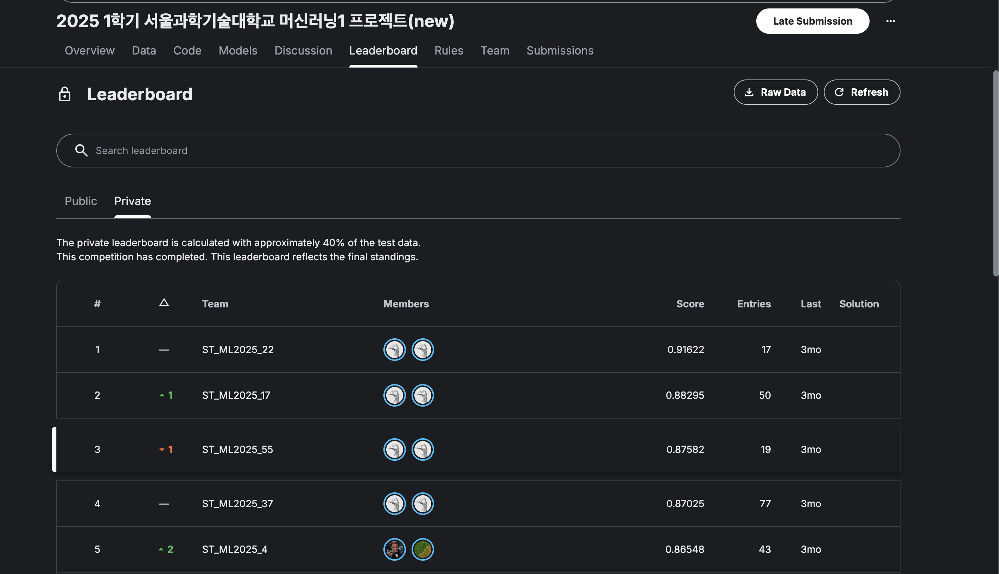

# Kaggle Competition — Temperature Forecasting (SeoulTech Machine Learning Class)

This repository documents my work for a Kaggle competition hosted as part of the SeoulTech Machine Learning course.
The objective was to predict the next day’s average temperature based on hourly weather measurements from the previous day.

The approach combined extensive feature engineering with the training and ensembling of multiple traditional machine learning models, evaluated using regression metrics.

📊 Result: Achieved 3rd place overall out of 67 teams on the competition leaderboard.

Since the competition page is currently private, the result is shown via the official leaderboard screenshot below.



## Dataset Fields
- id: Row id
- station: Weather station ID
- station_name: Weather station name
- date: Date (month–day)
- cloud_cover_n: Mid-level cloud cover (in tenths)
- dew_point_n: Dew point temperature (°C)
- humidity_n: Relative humidity (%)
- local_pressure_n: Local atmospheric pressure (hPa)
- min_cloud_height_n: Minimum cloud height (100 m units)
- precipitation_n: Precipitation (mm)
- sea_level_pressure_n: Sea-level atmospheric pressure (hPa)
- snow_depth_n: Snow depth (cm)
- sunshine_duration_n: Sunshine duration (hours)
- surface_temp_n: Surface temperature (°C)
- vapor_pressure_n: Vapor pressure (hPa)
- visibility_n: Visibility (10 m units)
- wind_speed_n: Wind speed (m/s)
- wind_direction_n: Wind direction (°)
- climatology_temp: Climatological mean temperature (°C) for the given date (7-year average, e.g., Jan 1 is averaged from Jan 1 of 2018–2024)


## Feature Engineering

### Statistical Summaries Pipeline

A custom mapping was designed to transform the original hourly features into condensed statistical summaries providing the models with richer and more meaningful inputs.

For example:
<pre>
cloud_cover_0 ~ cloud_cover_23
   → cloud_cover_early_night_mean
   → cloud_cover_late_night_mean
   → cloud_cover_when_min
   → cloud_cover_first_condition_hour
   → ...
</pre>

**Code snippet:**
```python
feature_config = {

    ...

    "cloud_cover_n": {
        "early_night_mean": True, "late_night_mean": True, "morning_mean": True,
        "afternoon_mean": True, "evening_mean": True, "late_evening_mean": True,
        "total_sum": False, "range": False, "direction_category": False,
        "when_min": True, "when_max": True, "first_condition_hour": True, "last_condition_hour": True, "total_mean": True
    },
    "dew_point_n": {
        "early_night_mean": True, "late_night_mean": True, "morning_mean": True,
        "afternoon_mean": True, "evening_mean": True, "late_evening_mean": True,
        "total_sum": False, "range": False, "direction_category": False,
        "when_min": True, "when_max": True, "first_condition_hour": False, "last_condition_hour": False, "estimate_air_temp" : True
    },

    ...

}

class Condenser(BaseEstimator, TransformerMixin):
    
    ...

    def transform(self, X):
        df = X[self.hour_cols].copy()
        result = pd.DataFrame(index=X.index)

            # Early Night (0–3)
        if self.config.get("early_night_mean"):
            idx = [i for i in range(0, 4)]
            cols = [self.hour_cols[i] for i in idx]
            result[f"{self.feature_name}_early_night_mean"] = df[cols].mean(axis=1)
    
        # Late Night (4–7)
        if self.config.get("late_night_mean"):
            idx = [i for i in range(4, 8)]
            cols = [self.hour_cols[i] for i in idx]
            result[f"{self.feature_name}_late_night_mean"] = df[cols].mean(axis=1)
    
    ...

class FeatureCondensationPipeline(BaseEstimator, TransformerMixin):

    ...

    def fit(self, X, y=None):
        # Instantiate and store a condenser for each feature
        self.condensers = [
            Condenser(feature, hour_cols, self.feature_config[feature])
            for feature, hour_cols in self.hour_col_map.items()
        ]
        # Fit all condensers (usually a no-op unless you add logic inside them)
        for condenser in self.condensers:
            condenser.fit(X, y)
        return self

    ...

```

### Polynomial Feature Generation

To extend the feature engineering process, each model was trained with an expanded set of ~9,000 polynomial features generated using the PolynomialFeatures library. From these, the top 30 most contributive features (based on model importance) were selected and incorporated into the final prediction model.

**Code snippet:**
```python
from sklearn.preprocessing import PolynomialFeatures

...

poly = PolynomialFeatures(degree=2, interaction_only=False, include_bias=False)
X_poly = poly.fit_transform(X_poly_process)

feature_names = poly.get_feature_names_out(X_poly_process.columns)
X_poly_df = pd.DataFrame(X_poly, columns=feature_names)

...

for name, model in models.items():

    ...

    # Get top 3000 features
    if hasattr(model, "feature_importances_"):
        importances = model.feature_importances_
        sorted_indices = np.argsort(importances)[::-1][:3000]
        top_features = X_train.columns[sorted_indices]
        
        # Store top 3000 features per model
        X_train_top3000_dict[name] = X_train[top_features].copy()
        top3000_features_dict[name] = list(top_features)
        
        print(f"✅ {name} top 3000 features extracted.")
    else:
        print(f"⚠️ {name} does not support feature_importances_. Skipping top 3000 extraction.")


```

## Ensembling
A stacked ensembling method was applied, where multiple base models were trained and their predictions were combined using a level-1 meta model for the final prediction.

- Base models: CatBoost, XGBoost, LightGBM, Random Forest, Ridge, ElasticNet
- Meta model: RidgeCV

This approach leverages the diversity of the base learners, improving overall predictive accuracy.

**Code snippet:**
```python

...

for i, (name, model) in enumerate(models.items()):
    test_meta_fold = np.zeros((X_test.shape[0], n_folds))

    # Preprocess X_test ONCE per model
    X_test_preprocessed = preprocess_for_model(name, X_train, X_test)[1]


    for j, (train_idx, val_idx) in enumerate(kf.split(X_train)):
        X_tr_raw = X_train.iloc[train_idx]
        X_val_raw = X_train.iloc[val_idx]
        y_tr = y_train.iloc[train_idx]
        y_val = y_train.iloc[val_idx]

        # Preprocess fold data
        cat_features = []
        X_tr, X_val, cat_features = preprocess_for_model(name, X_tr_raw, X_val_raw)
        # Align all 3 sets to ensure identical columns
        X_tr, X_val = X_tr.align(X_val, join="outer", axis=1, fill_value=0)
        X_tr, X_test_preprocessed = X_tr.align(X_test_preprocessed, join="outer", axis=1, fill_value=0)
        X_val, X_test_preprocessed = X_val.align(X_test_preprocessed, join="outer", axis=1, fill_value=0)

        model_clone = clone(model)

        if name == "LightGBM":
            model_clone.fit(X_tr, y_tr, categorical_feature=cat_features)
        elif name == "CatBoost":
            model_clone.fit(X_tr, y_tr, cat_features=cat_features)
        else:
            model_clone.fit(X_tr, y_tr)

        train_meta[val_idx, i] = model_clone.predict(X_val)
        test_meta_fold[:, j] = model_clone.predict(X_test_preprocessed)

    # Average test predictions across folds
    test_meta[:, i] = test_meta_fold.mean(axis=1)

# Fit and evaluate each meta-model
for name, model in meta_models.items():
    model.fit(train_meta, y_train)
    stack_preds = model.predict(test_meta)
    stack_r2 = r2_score(y_test, stack_preds)
    print(f"Level 1 meta model {name} R² score: {stack_r2:.4f}")

```